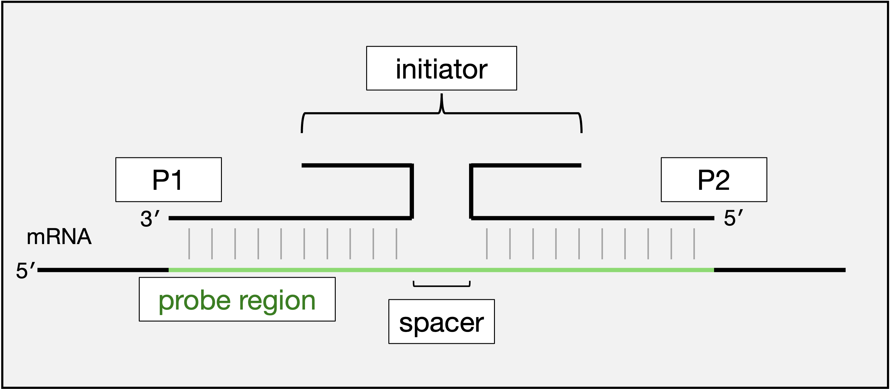
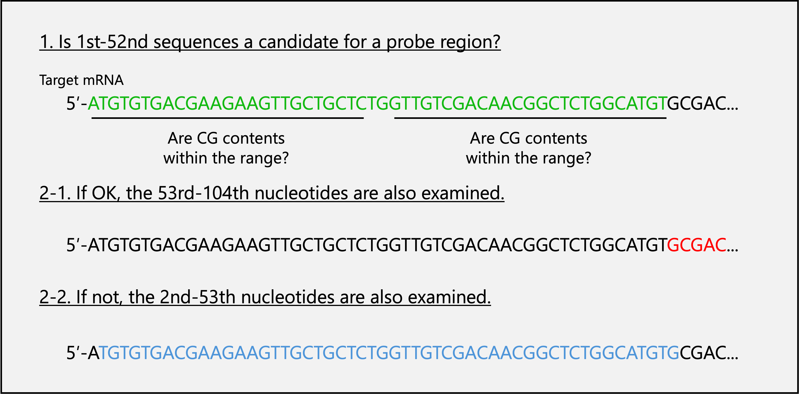

# Pipeline of split-initiator probe design

## I. Environment
We have verified that our R files work in the following environments.<br>
R version 4.3.3 (2024-02-29)

## II. Workflow of the pipeline
1. Find candidate regions for generating probes for the target mRNA (probe_region_finder_01.R).
2. Identify similarities in all RNAs except the target (Blastn).
3. Add the initiator sequence (split_initiator_probe_pair_generator_01.R).
4. Label the probes (probe_order_formatter_01.R).
 
## III. Glossary
 
 <p align="center">
  
</p>
<p align="center">
 Figure 1
</p>

 
- The ***probe region*** comprises a pair of probe binding sites and a ***spacer***. Considering that the probe binding site is 25 nucleotide (nt) and the spacer is 2 nt, the probe region is 52 nt.
- The probe for the 5′ mRNA region is Probe1 (***P1***), and the probe for the 3′ mRNA region is Probe2 (***P2***).
- Each probe contains part of the ***initiator*** sequence, and the neighboring probes complete the initiator sequence.
 
## IV. Criteria for the mRNA binding sites of probes
-  The GC content should be with 40–60% (45–55% is recommended)<sup>1</sup>.
- Designing with CDS of mRNA is recommended<sup>2</sup>.
 
## V. Overview of the probe_region_finder_01.R program
 
<p align="center">
  
</p>
<p align="center">
 Figure 2
</p>

1. As shown in Figure 2, the 1st-52nd sequence of the target mRNA (green letters in Figure 2) is checked to meet the requirements.
2. If the region meets the criteria, it is selected as a candidate Probe Region, and the sequence is shifted by 52 bases towards the 3′ end and examined. If it does not meet the requirements, the sequence is shifted by 1 base and examined.
3. Step 2 is repeated until a satisfactory number of probe regions is obtained.
 
## VI. Procedure for the probe_region_finder_01.R program
1. downloaded the DNA sequence of the target mRNA and saved as a fasta file.
2. Run probe_region_finder_01.R in the terminal. For exapmle... 

```
Rscript probe_region_finder.R -i tdTomato_dna.fasta -m 45 -M 55
```
 

- -i: the file name of target mRNA sequence.
- -m: minimum GC content of probes.
- -M: maxmum GC content of probes.
- -h: show the help.

3. The candidate sequences of the probe regions are output in fasta format. Information about the candidate probe regions is also output in text format. Details of the information file are below.

***Probe_Region_Sense*** is the mRNA sequence of the probe region. Sense indicates the same sequence as that of the target mRNA. 
***PRS GC Content*** is the GC content of the Probe Region:
***P1_GC Content*** is the GC content of P1,
***P2_GC Content*** is the GC content of P2,
***StartBp_num*** indicates the location of the first base of the probe region, and
***EndBp_num*** indicates the location of the end base.

> [!NOTE]
> The minimum number of probe sets in the previous study is five and increasing the number of probe sets improves the signal-to-noise ratio<sup>3</sup>.

> [!TIP]
> If an insufficient number of probe regions are obtained, the following steps are taken:
> - Relieve GC content condition to 40-60%.
> - Search the probe region in the UTR.
 
## VII. About Blastn
Only an adjacent pair of probes can form the initiator sequence and induce the amplification of the hairpin DNA<sup>2</sup>; therefore, we perform Blastn on the candidate probe regions rather than on individual probes. Since the probe regions are sense sequences, we searched for +/+ fields in the Blastn results. The threshold is less than 50% sequence homology<sup>4</sup>. The fasta file of the probe region output in procedure 3, section VI, can be used for the Blastn.
 

> [!IMPORTANT]
> Change the parameters since the probe region is short. For the browser Blast users, set word count to 7 and match/mismatch scores to 1, -3. For the local Blast users, use option -task with blastn-short.

 
## VIII. Procedure of the split_initiator_probe_pair_generator_01.R program
This program generates P1 and P2 by reverse-complementation and splitting of the probe region, and the sections are conjugated parts of the initiator sequence.
 
1. Make a table of necessary probe regions. Remove rows of the unnecessary probe
regions from the information file (.txt) generated in Procedure 3, Section VI.
2. Run probe_region_finder_01.R in the terminal. For exapmle... 

```
Rscript split_initiator_probe_pair_generator_01.R -i S73 tdTomato_ProbeRegionSense_45_55_selected.txt
```
or
```
Rscript split_initiator_probe_pair_generator.R -i custom-made_Hairpin-ID -s AAAAAAAAAAAAAAAAAAAAA tdTomato_ProbeRegionSense_45_55_selected.txt
```

- -i: the Hairpin DNA ID. S23, S41, S45, S72, S73, and A161 are predefined. 
- -s: (Optional) full intiator sequence. When you want to utilize custom-made Hairpin DNA, use this option.  
- -h: show the help. 


3. The Probe table is output as a CSV file.

## IX. Procedure of the probe_order_formatter_01.R program
Label the probe with the mRNA name, hairpin DNA ID, start position, and probe type (P1/P2).
1. Run probe_region_finder_01.R in the terminal. For exapmle... 

```
Rscript probe_order_formatter_01.R Probe_S73_tdTomato_ProbeRegionSense_45_55_selected.csv
```
2. The Probe table is output as a CSV file.
## X. Acknowledgment
We thank for Dr. Shunta Yorimoto for technical advice and providing codes. 

## XI. References
1. https://nepagene.jp/wp-content/uploads/ISHpalette_probe-design_v1-j.pdf
2. https://sites.google.com/view/in-situ-shhcr/faq
3. Choi HMT, Schwarzkopf M, Fornace ME, Acharya A, Artavanis G, Stegmaier J, Cunha A, Pierce NA. Third-generation _in situ_ hybridization chain reaction: multiplexed, quantitative, sensitive, versatile, robust. Development 2018; 145:dev165753.
4. Katayama Y, Saito A, Ogoshi M, Tsuneoka Y, Mukuda T, Azuma M, Kusakabe M, Takei Y, Tsukada T. Gene duplication of C-type natriuretic peptide-4 (CNP4) in teleost lineage elicits subfunctionalization of ancestral CNP. Cell Tissue Res 2022; 388:225–38.
 
 
